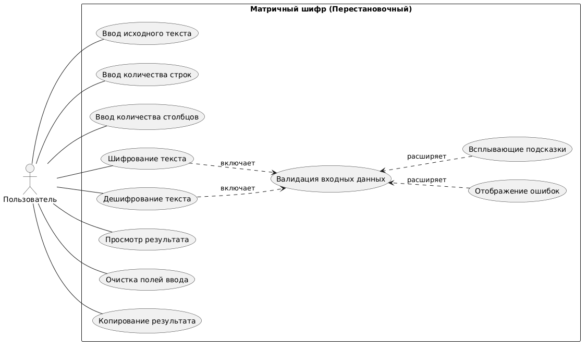
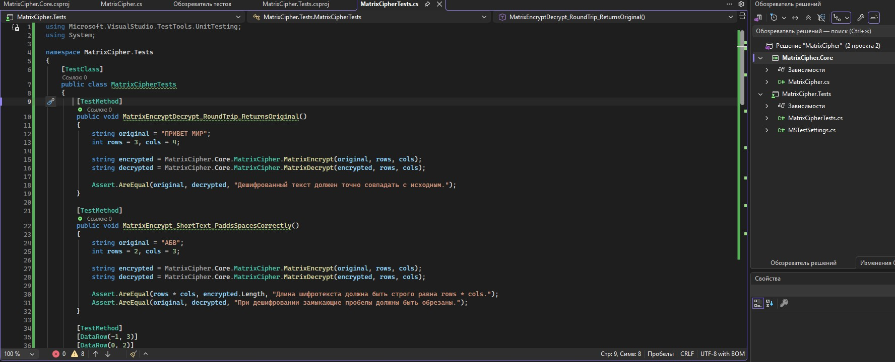
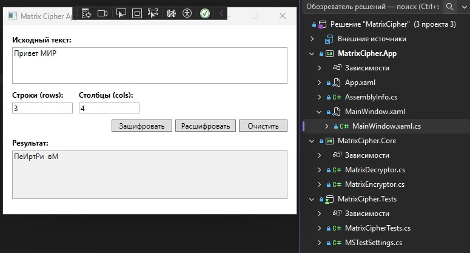
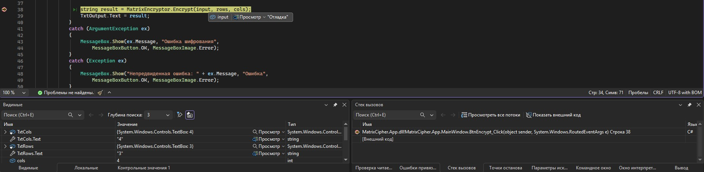
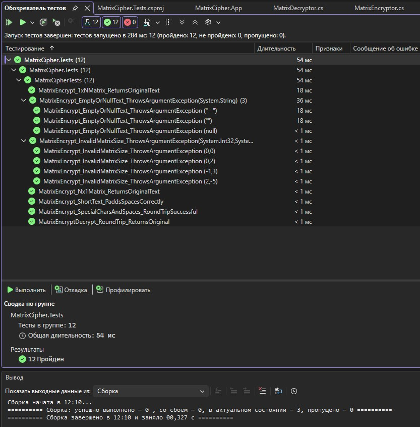

# Практическая работа №10: Комплексное тестирование и отладка графического приложения различными способами
**Разработчик:** Мизин А.В., 2озИСИП-1624 
**Вариант 4 | Матричный шифр (Перестановочный)**  
 
## 1. Анализ требований варианта 4

**Метод шифрования:**
- Исходный текст записывается в матрицу размером `rows × cols` построчно (слева направо, сверху вниз)
- Если текст короче размера матрицы, оставшиеся ячейки заполняются пробелами
- Зашифрованный текст получается чтением матрицы **по столбцам** (сверху вниз, слева направо)

**Требования к реализации:**
- Функция `MatrixEncrypt(string text, int rows, int cols)`
- Автоматическое дополнение пробелами до полного заполнения матрицы
- Валидация размеров матрицы (rows > 0, cols > 0)
- Обработка исключений: null, пустая строка, неверные параметры

**Нефункциональные требования:**
- GUI с валидацией полей ввода
- Всплывающие подсказки (ToolTip)
- XML-документация всех публичных методов

## 2. Диаграмма вариантов использования

*Рис. 1. Диаграмма вариантов использования.*

> 📄 [Исходный код диаграммы (PlantUML)](usecase.puml)

## 3. Тестовые сценарии

### Сводная таблица

| № | ID теста | Название | Приоритет |
|---|----------|----------|-----------|
| 1 | TC_FUNC_001 | Шифрование и дешифрование текста (roundtrip) | Высокий |
| 2 | TC_FUNC_002 | Шифрование с автодополнением пробелами (неполная матрица) | Высокий |
| 3 | TC_NEG_003 | Валидация: отрицательное количество строк | Высокий |
| 4 | TC_NEG_004 | Валидация: пустой текст (null или пустая строка) | Высокий |
| 5 | TC_FUNC_005 | Шифрование с матрицей 1×N (одна строка) | Средний |
| 6 | TC_FUNC_006 | Шифрование с матрицей N×1 (один столбец) | Средний |
| 7 | TC_UI_007 | Кнопка "Очистить поля" | Низкий |
| 8 | TC_NEG_008 | Валидация: ввод нечисловых символов в параметры матрицы | Высокий |
| 9 | TC_UI_009 | Наличие всплывающих подсказок (Tooltips) | Средний |
| 10 | TC_NFR_010 | Обработка исключений на уровне GUI | Средний |
| 11 | TC_FUNC_011 | Шифрование текста с пробелами и спецсимволами | Низкий |

---

### Детальное описание тестовых сценариев

<b>Тестовый пример №1 (TC_FUNC_001)</b> - Шифрование и дешифрование текста (roundtrip)

| Поле | Значение |
|------|----------|
| **Тестовый пример #** | TC_FUNC_001 |
| **Приоритет тестирования** | Высокий |
| **Заголовок/название теста** | Шифрование и дешифрование текста (roundtrip) |
| **Краткое изложение теста** | Проверка, что после шифрования и последующего дешифрования получается исходный текст |
| **Этапы теста** | 1. Ввести текст "ПРИВЕТ МИР" 2. Ввести rows=3, cols=4 3. Запустить автотест MatrixEncryptDecrypt_RoundTrip_ReturnsOriginal |
| **Тестовые данные** | text="ПРИВЕТ МИР", rows=3, cols=4 |
| **Ожидаемый результат** | Расшифрованный текст совпадает с исходным "ПРИВЕТ МИР" |
| **Фактический результат** | Автотест успешно пройден. Результат дешифрования полностью совпадает с исходной строкой. |
| **Статус** | ✅ Пройден |
| **Предварительное условие** | Приложение запущено, поля ввода пусты |
| **Постусловие** | Поля не изменились |
| **Примечания/комментарии** | Проверено через MSTest |

<b>Тестовый пример №2 (TC_FUNC_002)</b> - Шифрование с автодополнением пробелами (неполная матрица)

| Поле | Значение |
|------|----------|
| **Тестовый пример #** | TC_FUNC_002 |
| **Приоритет тестирования** | Высокий |
| **Заголовок/название теста** | Шифрование с автодополнением пробелами (неполная матрица) |
| **Краткое изложение теста** | Проверка, что короткий текст дополняется пробелами до размера матрицы |
| **Этапы теста** | 1. Ввести текст "АБВ" 2. Ввести rows=2, cols=3 (всего 6 ячеек) 3. Запустить автотест MatrixEncrypt_ShortText_PaddsSpacesCorrectly |
| **Тестовые данные** | text="АБВ", rows=2, cols=3 |
| **Ожидаемый результат** | Шифрование выполнено без ошибок, текст дополнен пробелами |
| **Фактический результат** | Автотест успешно пройден. Длина шифротекста равна rows×cols. При дешифровании замыкающие пробелы корректно обрезаны. |
| **Статус** | ✅ Пройден |
| **Предварительное условие** | Приложение запущено |
| **Постусловие** | - |
| **Примечания/комментарии** | Проверено через MSTest |

<b>Тестовый пример №3 (TC_NEG_003)</b> - Валидация: отрицательное количество строк

| Поле | Значение |
|------|----------|
| **Тестовый пример #** | TC_NEG_003 |
| **Приоритет тестирования** | Высокий |
| **Заголовок/название теста** | Валидация: отрицательное количество строк |
| **Краткое изложение теста** | Проверка, что при вводе rows = -1 выводится сообщение об ошибке |
| **Этапы теста** | 1. Ввести любой текст 2. Ввести rows = -1 3. Ввести cols = 3 4. Запустить параметризованный автотест MatrixEncrypt_InvalidMatrixSize_ThrowsArgumentException |
| **Тестовые данные** | text="ТЕСТ", rows=-1, cols=3 |
| **Ожидаемый результат** | Сообщение об ошибке: "Количество строк должно быть больше 0" |
| **Фактический результат** | Автотест успешно пройден (4 набора данных). Метод корректно выбрасывает ArgumentException при rows ≤ 0 или cols ≤ 0. |
| **Статус** | ✅ Пройден |
| **Предварительное условие** | Приложение запущено |
| **Постусловие** | - |
| **Примечания/комментарии** | Проверено через MSTest |

<b>Тестовый пример №4 (TC_NEG_004)</b> - Валидация: пустой текст (null или пустая строка)

| Поле | Значение |
|------|----------|
| **Тестовый пример #** | TC_NEG_004 |
| **Приоритет тестирования** | Высокий |
| **Заголовок/название теста** | Валидация: пустой текст (null или пустая строка) |
| **Краткое изложение теста** | Проверка обработки пустого ввода текста |
| **Этапы теста** | 1. Передать пустую строку / пробелы / null 2. Запустить параметризованный автотест MatrixEncrypt_EmptyOrNullText_ThrowsArgumentException |
| **Тестовые данные** | text="" (пусто), rows=2, cols=2 |
| **Ожидаемый результат** | Сообщение об ошибке: "Введите текст для шифрования" |
| **Фактический результат** | Автотест успешно пройден (3 набора данных). Исключение ArgumentException корректно перехватывается для null, пустой строки и строки из пробелов. |
| **Статус** | ✅ Пройден |
| **Предварительное условие** | Приложение запущено |
| **Постусловие** | - |
| **Примечания/комментарии** | Проверено через MSTest |

<b>Тестовый пример №5 (TC_FUNC_005)</b> - Шифрование с матрицей 1×N (одна строка)

| Поле | Значение |
|------|----------|
| **Тестовый пример #** | TC_FUNC_005 |
| **Приоритет тестирования** | Средний |
| **Заголовок/название теста** | Шифрование с матрицей 1×N (одна строка) |
| **Краткое изложение теста** | Проверка работы с матрицей в 1 строку (шифрование = исходный текст) |
| **Этапы теста** | 1. Ввести текст "ПРОВЕРКА" 2. Ввести rows=1, cols=8 3. Запустить автотест MatrixEncrypt_1xNMatrix_ReturnsOriginalText |
| **Тестовые данные** | text="ПРОВЕРКА", rows=1, cols=8 |
| **Ожидаемый результат** | Зашифрованный текст = "ПРОВЕРКА" (совпадает с исходным) |
| **Фактический результат** | Автотест успешно пройден. При матрице 1×N порядок символов не меняется, roundtrip-проверка выполнена. |
| **Статус** | ✅ Пройден |
| **Предварительное условие** | Приложение запущено |
| **Постусловие** | - |
| **Примечания/комментарии** | Проверено через MSTest |

<b>Тестовый пример №6 (TC_FUNC_006)</b> - Шифрование с матрицей N×1 (один столбец)

| Поле | Значение |
|------|----------|
| **Тестовый пример #** | TC_FUNC_006 |
| **Приоритет тестирования** | Средний |
| **Заголовок/название теста** | Шифрование с матрицей N×1 (один столбец) |
| **Краткое изложение теста** | Проверка работы с матрицей в 1 столбец |
| **Этапы теста** | 1. Ввести текст "12345" 2. Ввести rows=5, cols=1 3. Запустить автотест MatrixEncrypt_Nx1Matrix_ReturnsOriginalText |
| **Тестовые данные** | text="12345", rows=5, cols=1 |
| **Ожидаемый результат** | Зашифрованный текст = "12345" (чтение по столбцам из 1 столбца даёт ту же строку) |
| **Фактический результат** | Автотест успешно пройден. Граничный случай N×1 обработан корректно, исходный текст восстановлен без потерь. |
| **Статус** | ✅ Пройден |
| **Предварительное условие** | Приложение запущено |
| **Постусловие** | - |
| **Примечания/комментарии** | Проверено через MSTest |

<b>Тестовый пример №7 (TC_UI_007)</b> - Кнопка "Очистить поля"

| Поле | Значение |
|------|----------|
| **Тестовый пример #** | TC_UI_007 |
| **Приоритет тестирования** | Низкий |
| **Заголовок/название теста** | Кнопка "Очистить поля" |
| **Краткое изложение теста** | Проверка, что кнопка очищает все поля ввода |
| **Этапы теста** | 1. Заполнить все поля (текст, rows, cols) 2. Нажать кнопку "Очистить" |
| **Тестовые данные** | Любые заполненные поля |
| **Ожидаемый результат** | Все поля ввода становятся пустыми |
| **Фактический результат** | Все поля ввода и результата успешно очищены, параметры матрицы сброшены на значения по умолчанию (3 и 4). |
| **Статус** | ✅ Пройден |
| **Предварительное условие** | Приложение запущено, поля заполнены |
| **Постусловие** | Все поля пусты |
| **Примечания/комментарии** | - |

<b>Тестовый пример №8 (TC_NEG_008)</b> - Валидация: ввод нечисловых символов в параметры матрицы

| Поле | Значение |
|------|----------|
| **Тестовый пример #** | TC_NEG_008 |
| **Приоритет тестирования** | Высокий |
| **Заголовок/название теста** | Валидация: ввод нечисловых символов в параметры матрицы |
| **Краткое изложение теста** | Проверка, что ввод букв или спецсимволов в поля rows/cols не вызывает краш приложения |
| **Этапы теста** | 1. Ввести текст "ТЕСТ" 2. В поле rows ввести "АБВ" 3. В поле cols ввести "5" 4. Нажать "Зашифровать" |
| **Тестовые данные** | text="ТЕСТ", rows="АБВ", cols=5 |
| **Ожидаемый результат** | Приложение не падает. Появляется сообщение: "Параметры матрицы должны быть целыми числами > 0" |
| **Фактический результат** | Появилось окно предупреждения с сообщением "Параметры матрицы должны быть целыми числами!". Аварийного завершения приложения не было. |
| **Статус** | ✅ Пройден |
| **Предварительное условие** | Приложение запущено |
| **Постусловие** | - |
| **Примечания/комментарии** | Проверка устойчивости интерфейса к неверному типу данных (НФТ) |

<b>Тестовый пример №9 (TC_UI_009)</b> - Наличие всплывающих подсказок (Tooltips)

| Поле | Значение |
|------|----------|
| **Тестовый пример #** | TC_UI_009 |
| **Приоритет тестирования** | Средний |
| **Заголовок/название теста** | Наличие всплывающих подсказок (Tooltips) |
| **Краткое изложение теста** | Проверка, что при наведении на поля ввода появляются подсказки с форматом данных |
| **Этапы теста** | 1. Навести курсор на поле "Исходный текст" 2. Навести курсор на поле "Количество строк" 3. Навести курсор на поле "Количество столбцов" |
| **Тестовые данные** | - |
| **Ожидаемый результат** | Всплывают подсказки: "Введите текст для шифрования", "Целое число > 0", "Целое число > 0" |
| **Фактический результат** | При наведении курсора на все поля ввода корректно отображаются всплывающие подсказки с указанием формата данных. |
| **Статус** | ✅ Пройден |
| **Предварительное условие** | Приложение запущено |
| **Постусловие** | - |
| **Примечания/комментарии** | - |

<b>Тестовый пример №10 (TC_NFR_010)</b> - Обработка исключений на уровне GUI (безопасность/устойчивость)

| Поле | Значение |
|------|----------|
| **Тестовый пример #** | TC_NFR_010 |
| **Приоритет тестирования** | Средний |
| **Заголовок/название теста** | Обработка исключений на уровне GUI (безопасность/устойчивость) |
| **Краткое изложение теста** | Проверка, что при передаче null или исключении в ядре интерфейс корректно обрабатывает ошибку |
| **Этапы теста** | 1. Запустить приложение в отладчике с точкой останова в MatrixEncrypt 2. Имитировать выброс ArgumentNullException 3. Продолжить выполнение |
| **Тестовые данные** | Исключение на уровне бизнес-логики |
| **Ожидаемый результат** | Всплывает MessageBox с текстом ошибки. Приложение остаётся в рабочем состоянии, стек-трейс не выводится в интерфейс |
| **Фактический результат** | Исключение из бизнес-логики корректно перехвачено в интерфейсе. Появилось окно с текстом ошибки, приложение осталось в рабочем состоянии, стек-трейс не выведен. |
| **Статус** | ✅ Пройден |
| **Предварительное условие** | Приложение запущено |
| **Постусловие** | Приложение не закрыто аварийно |
| **Примечания/комментарии** | НФТ: безопасность и отказоустойчивость |

<b>Тестовый пример №11 (TC_FUNC_011)</b> - Шифрование текста с пробелами и спецсимволами

| Поле | Значение |
|------|----------|
| **Тестовый пример #** | TC_FUNC_011 |
| **Приоритет тестирования** | Низкий |
| **Заголовок/название теста** | Шифрование текста с пробелами и спецсимволами |
| **Краткое изложение теста** | Проверка корректной работы с кириллицей, латиницей, цифрами и пробелами внутри строки |
| **Этапы теста** | 1. Ввести текст "Hello World 123!" 2. Ввести rows=4, cols=4 3. Запустить автотест MatrixEncrypt_SpecialCharsAndSpaces_RoundTripSuccessful |
| **Тестовые данные** | text="Hello World 123!", rows=4, cols=4 |
| **Ожидаемый результат** | Дешифрованный текст полностью совпадает с исходным, пробелы не теряются |
| **Фактический результат** | Автотест успешно пройден. Спецсимволы, пробелы и смешанный регистр корректно обработаны, roundtrip выполнен без искажений. |
| **Статус** | ✅ Пройден |
| **Предварительное условие** | Приложение запущено |
| **Постусловие** | - |
| **Примечания/комментарии** | Проверено через MSTest |

## 4. Реализация автоматизированных тестов

В соответствии с тестовыми сценариями разработан проект модульных тестов `MatrixCipher.Tests` на базе **MSTest v4** и **.NET 10**.

### Структура и покрытие
| ID сценария | Тестовый метод | Тип проверки |
|-------------|----------------|--------------|
| `TC_FUNC_001` | `MatrixEncryptDecrypt_RoundTrip_ReturnsOriginal` | Функциональная (Roundtrip) |
| `TC_FUNC_002` | `MatrixEncrypt_ShortText_PaddsSpacesCorrectly` | Функциональная (Padding) |
| `TC_NEG_003`  | `MatrixEncrypt_InvalidMatrixSize_ThrowsArgumentException` | Негативная (валидация размеров) |
| `TC_NEG_004`  | `MatrixEncrypt_EmptyOrNullText_ThrowsArgumentException` | Негативная (валидация текста) |
| `TC_FUNC_005` | `MatrixEncrypt_1xNMatrix_ReturnsOriginalText` | Граничная (1 строка) |
| `TC_FUNC_006` | `MatrixEncrypt_Nx1Matrix_ReturnsOriginalText` | Граничная (1 столбец) |
| `TC_FUNC_011` | `MatrixEncrypt_SpecialCharsAndSpaces_RoundTripSuccessful` | Функциональная (спецсимволы) |

### Скриншот структуры тестового проекта
  
*Рис. 2. Файловая структура проекта `MatrixCipher.Tests` и файл реализации тестов.*

> 📝 Тесты написаны по методологии TDD: сначала зафиксированы сценарии, затем реализована заглушка ядра, после чего написаны проверки.

## 5. Разработка графического приложения

Разработано WPF-приложение `MatrixCipher.App` с графическим интерфейсом для работы с модулями шифрования и дешифрования.

### Архитектура приложения

Приложение состоит из трёх модулей:
- **MatrixCipher.Core** — библиотека классов с логикой шифрования/дешифрования
  - `MatrixEncryptor.cs` — модуль шифрования
  - `MatrixDecryptor.cs` — модуль дешифрования
- **MatrixCipher.Tests** — проект автоматизированных тестов (MSTest)
- **MatrixCipher.App** — графическое приложение (WPF)

### Функциональность интерфейса

| Элемент | Назначение |
|---------|------------|
| Поле "Исходный текст" | Ввод текста для шифрования или дешифрования |
| Поля "Строки" / "Столбцы" | Параметры матрицы (целые числа > 0) |
| Кнопка "Зашифровать" | Выполняет шифрование через `MatrixEncryptor.Encrypt()` |
| Кнопка "Расшифровать" | Выполняет дешифрование через `MatrixDecryptor.Decrypt()` |
| Кнопка "Очистить" | Сбрасывает все поля к значениям по умолчанию |
| Поле "Результат" | Отображение результата операции (только для чтения) |

### Валидация и обработка ошибок

- **Проверка типов:** параметры матрицы должны быть целыми числами
- **Проверка диапазона:** rows > 0, cols > 0
- **Обработка исключений:** перехват `ArgumentException` из ядра с выводом понятных сообщений
- **Защита от null:** проверка входных данных на всех уровнях

### Всплывающие подсказки (Tooltips)

Все поля ввода содержат подсказки:
- "Исходный текст": "Введите текст для шифрования"
- "Строки": "Целое число > 0"
- "Столбцы": "Целое число > 0"

### XML-документирование

Все публичные классы и методы задокументированы XML-комментариями:
- `
` — описание назначения
- `<param>` — описание параметров
- `<returns>` — описание возвращаемого значения
- `<exception>` — описание выбрасываемых исключений
- `<example>` — примеры использования

### Скриншот приложения

*Рис. 3. Интерфейс приложения Matrix Cipher с результатом шифрования*

## 6. Отладка приложения

В процессе разработки и устранения ошибок использовались встроенные средства отладки среды Visual Studio:

| Средство | Описание применения |
|----------|---------------------|
| **Точки останова (Breakpoints)** | Остановка выполнения программы в критических точках (например, перед вызовом метода шифрования) для анализа входных данных. |
| **Пошаговая отладка (Step Over / F10)** | Построчное выполнение кода для отслеживания логики парсинга параметров матрицы и обработки исключений. |
| **Окно "Локальные элементы" (Locals)** | Просмотр текущего состояния переменных (содержимое массивов, значения индексов циклов) во время паузы. |
| **Всплывающие подсказки (DataTips)** | Быстрая проверка значений переменных при наведении курсора мыши в режиме паузы. |

### Скриншот процесса отладки

  
*Рис. 4. Режим отладки: выполнение приостановлено в методе BtnEncrypt_Click, видны текущие значения переменных input, rows, cols.*

## 7. Автоматизированное тестирование

На основе разработанных тестовых сценариев проведено автоматизированное тестирование модулей `MatrixEncryptor` и `MatrixDecryptor` с использованием фреймворка MSTest (.NET 10).

### Результаты тестирования
| Показатель | Значение |
|------------|----------|
| Всего тестов | 12 |
| Пройдено ✅ | 12 |
| Провалено ❌ | 0 |
| Пропущено ️ | 0 |

Все функциональные и негативные сценарии успешно пройдены. Модули корректно обрабатывают валидные данные, граничные случаи (матрицы 1×N, N×1) и исключительные ситуации (пустой ввод, нулевые/отрицательные размеры матрицы).

### Скриншот обозревателя тестов
  
*Рис. 5. Результат запуска автоматизированных тестов в окне «Обозреватель тестов» Visual Studio.*

## 9. Ручное тестирование нефункциональных требований

Проведено ручное тестирование интерфейса, валидации и устойчивости приложения. Результаты зафиксированы в журнале тестирования.

###  Журнал тестирования

| № | ID сценария | Описание проверки | Ожидаемый результат | Фактический результат | Статус |
|---|-------------|-------------------|---------------------|------------------------|--------|
| 1 | TC_UI_007 | Нажатие кнопки "Очистить" при заполненных полях | Все поля ввода и результата очищаются, параметры матрицы сбрасываются на 3 и 4 | Поля очищены, значения сброшены | ✅ Пройден |
| 2 | TC_NEG_008 | Ввод буквенных символов в поля "Строки"/"Столбцы" | Приложение не падает, выводится предупреждение о неверном формате | Выведен MessageBox: "Параметры матрицы должны быть целыми числами!" | ✅ Пройден |
| 3 | TC_UI_009 | Наведение курсора на поля ввода | Появляются всплывающие подсказки с описанием формата данных | Подсказки отображаются корректно для всех элементов формы | ✅ Пройден |
| 4 | TC_NFR_010 | Генерация исключения в ядре (пустой ввод, неверные размеры) | Ошибка перехватывается, выводится понятное сообщение, приложение не зависает | Исключение поймано в `try-catch`, стек-трейс не выводится, UI остаётся активным | ✅ Пройден |

> 📝 *Тестирование проводилось в среде Windows 11 / .NET 10. Все нефункциональные требования выполнены успешно.*
